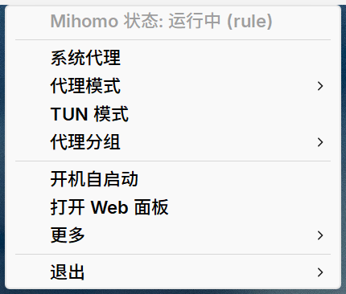
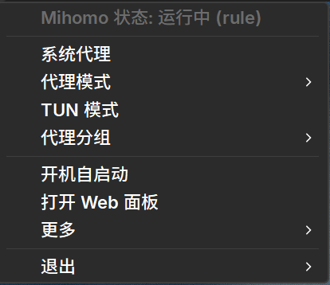

# mihomo-tray-rs

一款基于 Rust 的控制本机 [mihomo](https://github.com/MetaCubeX/mihomo) Windows 系统托盘应用。
**体积小、内存小、依赖少**：原生 Win32 + WinHTTP，不引入 WebView、HTTP 客户端库或 YAML 库。



菜单主题跟随系统，运行中切换明暗即时生效：



## 特性

- **状态行** — `Mihomo 状态: 运行中 (rule)` / `未运行` / `控制器不可达`
- **系统代理** — 写 `HKCU\...\Internet Settings` 并通知 WinINet 刷新（只写注册表不会即时生效）
- **代理模式** — Rule / Global / Direct 单选互斥，勾选当前值
- **TUN 模式** — 切换后回读 `tun.enable` 确认；内核没有管理员权限时弹一次 UAC
- **代理分组** — `GLOBAL` 与其余可切换组，逐层子菜单；成员打钩表示当前节点，只读组灰显
- **节点延迟（文本）** — 组子菜单顶部的「测速本组节点」调 `GET /group/{name}/delay`，测完的节点在名称后带 `(123ms)`，超时显示 `(超时)`，并自动按延迟从快到慢排列。原生菜单项，不做 owner-draw 色点（见 [docs/DESIGN.md](docs/DESIGN.md) §3.2）
- **开机自启动** — HKCU `Run` 键，不触发 UAC
- **「更多」子菜单** — `重载配置` / `关闭所有连接` / `重启内核` / `强制重启内核`（各自做什么见「已知行为」）
- **打开 Web 面板** — 用默认浏览器打开面板地址，可在 `tray.yml` 里换成外部托管的面板（如 zashboard / metacubexd）
- **退出** — 「退出并停止 Mihomo」（只结束本程序掌控的实例）/「仅退出程序」
- 单实例互斥；资源管理器重启后自动重新注册托盘图标；菜单主题跟随系统，运行中切换明暗即时生效

## 环境要求

- Windows 10/11 (x64)
- [mihomo](https://github.com/MetaCubeX/mihomo) 已安装；本程序会**自发现**它（同目录 → `PATH`），也可以照旧在 `tray.yml` 里写明 `mihomo.path`
- 构建需要 Rust stable（`edition 2024`，MSRV 1.85），无需额外工具链

## 构建

```powershell
cargo build --release      # 产出 target/release/mihomo-tray.exe
cargo test                 # 设置解析 / URL 编码 / 地址解析的单测
```

`[profile.release]` 使用 `opt-level="z" + lto + codegen-units=1 + panic="abort" + strip`，并**不做**任何压缩打包。应用清单（Common-Controls v6 + supportedOS Win10/11 + per-monitor-v2 DPI）由 `build.rs` 用纯 linker 参数嵌入，决定菜单的圆角/主题/DPI 是否正确。

实测（本机 Win11 x64，rustc 1.98.0，release 构建后冷启动 20 s 的读数）：

| 指标 | 数值 |
|---|---|
| 可执行文件 | ~340 KiB (实测 347,648 B) |
| 空闲私有内存 | ~2.2 MB（私有工作集；总私有提交 ~2.8 MB，含 WinHTTP 内部线程） |
| 空闲工作集 | ~15 MB（多为共享 DLL 页） |
| 依赖 | `windows-sys`、`serde_json`、`winreg`（+ 构建期无依赖） |

## 设置文件

`tray.yml`：**exe 同目录优先**（便携），否则 `%APPDATA%\mihomo-tray\tray.yml`。首次运行会按当前界面语言写出模板，也可以直接从仓库复制 [`tray_Sample_zh.yml`](tray_Sample_zh.yml) / [`tray_Sample_en.yml`](tray_Sample_en.yml)。

- **路径必须绝对**：盘符路径（`C:\...`）或 UNC 路径（`\\server\share\...`）；`%NAME%` 按 cmd 的规则展开。相对路径和 `~` 会被拒绝——内核会拿相对路径去拼它的工作目录，那个目录不是任何人选的。
- 同目录那份**必须有内容**才算数：scoop 清单会建一个 0 字节的 `tray.yml`，空文件（以及读不到的文件）会回退 `%APPDATA%`。打包时请把示例装成 `tray.yml`，不要建空文件。
- 只支持一个极简 YAML 子集：顶层键、一层嵌套、`#` 注释、引号标量与内联 `[a, b]` 列表。

```yaml
mihomo:
  path: ""            # mihomo.exe；必填、绝对路径
  home: ""            # 内核的 -d（配置目录）；留空 = 内核默认 %USERPROFILE%\.config\mihomo
  config: ""          # 内核的 -f（配置文件）；留空且 home 非空 = <home>\config.yaml
  args: []            # 额外启动参数，原样透传（%NAME% 同样展开）；不要再写 -d/-f/-ext-ctl/-secret
  auto_start: true    # 未运行时自动拉起内核
controller:
  address: ""         # 仅兜底：内核没有设置 external-controller、或它的配置读不到时才用
  secret: ""          # 仅兜底：与 address 同一条件
  timeout_ms: 2000
proxy:
  bypass: []          # 追加到 ProxyOverride，始终包含 <local>
groups:
  order: []           # 显式分组顺序，其余按字典序（GLOBAL 永远在最前）
  include: []         # 留空 = 全部 Selector
  exclude: []
  page_size: 0        # 0 = 交给系统滚动箭头；>0 时长列表拆成翻页子菜单
ui:
  web_url: ""         # 面板地址；留空 = http://<控制器地址>/ui/（内核自己的 external-ui）
                      # {host}/{port}/{secret} 会替换成当前控制器，例如：
                      # https://board.zash.run.place/#/setup?hostname={host}&port={port}&secret={secret}
  poll_interval_ms: 3000
  dark_menu: auto     # auto | always | never
```

`mihomo.args` 里写 `-d`/`-f`/`-ext-ctl`/`-secret` 会被**直接拒绝**（启动期报错并指出该用哪个字段）：同一设置写两处，内核和本程序就会读到不同的文件。

## 界面语言

界面内置中文（默认）与英文，**语言跟随 Windows 的显示语言，没有单独的开关**。其它语言由使用者自行提供：

1. 在 `tray.yml` 的同目录下建 `lang/`（便携模式下是 exe 同目录，否则是 `%APPDATA%\mihomo-tray\lang\`）；
2. 文件名用**系统语言的 BCP-47 标签**（查法：PowerShell 里 `(Get-UICulture).Name`），例如 `ja-JP.yml`、`ko-KR.yml`；
3. 内容照抄仓库里的 [`lang/en-US.yml`](lang/en-US.yml)（自带注释，也是模板），把右侧的值换成译文。

格式是 `段名:` 加两空格缩进的 `键: 值`；文件里没有的键回退内置英文，值写成空等同于没写。

## 内核、配置与控制器来自哪里

**内核会自发现，配置按 mihomo 自己的规则解析，没有端口探测**：认不出来就报错（并指出该改哪一项），而不是猜一个。下面是每一项的**优先级顺序**，左边优先、右边兜底：

| 目标 | 优先级顺序 |
|---|---|
| `mihomo.exe` | ① `tray.yml mihomo.path`——**填了就只认它**，不存在或写成相对路径会在启动期报错，不会退回搜索 → ② 自发现：本程序同目录（含 `bin\`、`core\`）→ ③ `PATH` 各目录，`PATH` 顺序即优先级。**只找 `mihomo.exe` 这个名字**（命中 scoop 的 `shims\mihomo.exe` 时按它的 `mihomo.shim` 认到真内核）；内核改了名就在 `mihomo.path` 里写它 |
| 配置目录 | ① `tray.yml mihomo.home` → ② `mihomo.config` 所在目录 → ③ 内核带来的那份配置所在目录 → ④ 内核默认 `%USERPROFILE%\.config\mihomo`（`XDG_CONFIG_HOME` 只在该目录不存在时参与） |
| 配置文件 | ① `tray.yml mihomo.config` → ② 配置目录下的 `config.yaml`；`home`/`config` 都留空时先看内核带来的那份——内核在**本程序目录树**里时先看本程序所在目录的 `config.yaml`，再看内核同目录的，都没有才落到内核默认目录。候选按**文件是否存在**挑 |
| 控制器地址 / secret | ① 运行中内核自己的命令行（`-ext-ctl` / `-secret`，非空时**覆盖**配置文件）→ ② `CLASH_OVERRIDE_EXTERNAL_CONTROLLER` / `CLASH_OVERRIDE_SECRET` 环境变量 → ③ 配置文件里的 `external-controller` / `secret` → ④ `tray.yml controller.address` / `secret` |
| 系统代理 / TUN | 都不由内核管理，由本程序处理 |

几条与使用直接相关的：

- `controller.*` 是**兜底而非覆盖**，逐字段判定：只有内核那边没设置、或读不到时才会用 `tray.yml` 的值。
- 控制器不可达时状态行显示「控制器不可达」，模式 / TUN / 分组项灰显；此时**不会**自动重启内核，只在 `mihomo.auto_start` 为真且内核进程确实不存在时才拉起。
- 自发现到内核时状态行会说明一次（`已自发现内核: <路径>`）；全都落空时报「没找到 mihomo.exe」。
- 看不到的情况只有一种：**内核由别的启动器拉起、用命令行覆盖了控制器、而它的命令行又读不到**（提权内核就是这种）。这时请把实际值写进 `controller.*`；也正因为如此，控制器只按明文 http 访问（写 `https://` 会被明确拒绝）。
- 提权之后 `%USERPROFILE%` 等环境会变，所以本程序启动内核时一律显式传 `-d`/`-f`（绝对路径）：内核读的就是上面解析出来的那一份。

## 已知行为

原理见 [docs/DESIGN.md](docs/DESIGN.md)（§4、§5、§5.1、§8）。

- **TUN 需要管理员权限**：内核建不起 Wintun 时弹一次 UAC，由本程序的一个隐藏副本把内核换成提权实例后重试；取消 UAC 只是这次不生效，没有副作用。
- **内核一旦提权就一直提权**（TUN 生效之后）：「退出并停止 Mihomo」会再弹一次 UAC；取消则程序继续运行。
- 只读组（`LoadBalance` 与普通节点）的成员不可点击，仅展示当前值。
- `URLTest`/`Fallback` 组被点选后会进入「已固定」状态（组名带 `· 已固定`），此时内核不再自动测速换节点；用组内的「自动（取消固定）」恢复。重载配置会清除固定。
- **「测速本组节点」是整组串行测**：内核逐个节点用 3 s 预算试一次，所以菜单里那一项会等上几秒（请求侧单独放宽到 30 s，不受 `controller.timeout_ms` 限制）；结果显示在下一次刷新后的成员标签里，而不是弹窗。测速本身不改变当前选中节点，只写各节点的 `history`。
- **「重启内核」与「强制重启内核」不是一回事**：前者让内核自己换一个进程（提权保持、不需要 UAC，也管不到别人启动的内核）；后者结束当前内核、按 `tray.yml` 重新拉起，是"把别人的内核变成我们知道的样子"的手段，没有内核在跑时灰显。
- Windows 11 默认把新的托盘图标收进溢出区，首次运行需要手动把它拖到任务栏固定。

## 与 Go 版 [`mihomo-tray`](https://github.com/aoiyukizakura/mihomo-tray) 的差异

指 [aoiyukizakura/mihomo-tray](https://github.com/aoiyukizakura/mihomo-tray)（Go + systray，本程序即其思路的 Rust 重写）。相对它的不同：

- **托盘自身不提权**：Go 版启动时就用 `ShellExecute("runas")` 把整个程序提权；这里托盘始终普通权限，只有 TUN 需要管理员。
- **停止内核是选择性的**：只结束本程序启动、或路径与本程序发现结果一致的实例，不会按映像名批量结束。
- **内核与配置优先由 `tray.yml` 指明**：Go 版固定读 `%USERPROFILE%\.config\mihomo\config.yaml`、只在 PATH / 程序目录 / `~/scoop/shims` 找内核；这里的顺序见「内核、配置与控制器来自哪里」。
- **新增**：代理分组子菜单（含固定与取消固定）、「打开 Web 面板」、`lang/*.yml` 语言文件、可配轮询间隔（Go 版固定 5 s）、「更多」子菜单（见「特性」）。
- **同样不做**（相对 CFW 式图形客户端）：设置窗口、自绘弹窗、**节点延迟色点**（延迟只以文本 `(123ms)` 呈现，见「特性」）、流量曲线、订阅刷新、脚本执行；需要图形化的设置就用内核自己的面板（菜单里的「打开 Web 面板」）。

更细的设计说明见 [docs/DESIGN.md](docs/DESIGN.md)。

## 许可证

[MIT](LICENSE)
